**Exploratory Data Analysis on the Automobile Data Set**

**Introduction**

Automobile data consist of 205 rows and 26 columns. Automobiles data
consist of object, float, and int datatype, Object being the highest in
the dataset.

**DATA CLEANING**

**Methods used for data cleansing**

-   df_automobile.info()

This displays the number of non-null values in each column

-   df_automobile.isna().**sum**()

**to calculate the number of missing values in each column**

-   df_automobile\[\[**\'normalized-losses\'**,**\'price\'**,**\'horsepower\'**,**\'peak-rpm\'**,**\'bore\'**,**\'stroke\'**\]\] = df_automobile\[\[**\'normalized-losses\'**,**\'price\'**,**\'horsepower\'**,**\'peak-rpm\'**,**\'bore\'**,**\'stroke\'**\]\].fillna(value=df_automobile\[\[**\'normalized-losses\'**,**\'price\'**,**\'horsepower\'**,**\'peak-rpm\'**,**\'bore\'**,**\'stroke\'**\]\].mean())

Used to replace the NaNs in columns by the mean of values in that column

-   df_automobile\[**\'num-of-doors\'**\] = df_automobile\[**\'num-of-doors\'**\].fillna(df_automobile\[**\'num-of-doors\'**\].mode()\[0\])

Used to replace the NaNs in columns by the mode of values in that column

**Visualization done during data cleaning**

-   **Used missingno extension to visualize missing data in each
    column**

**Before data impunity graph looked like this**

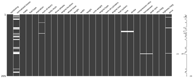

-   **Data after data impunity**

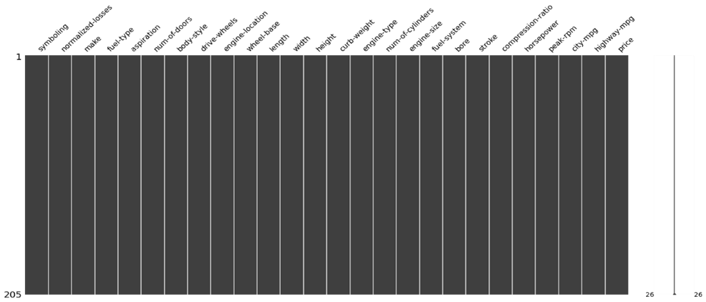

MISSING DATA

The data did have some missing values as depicted by the graph above.

Data impunity using mean and mode was used to deal with missing data.

DATA STORIES AND VISUALIZATIONS

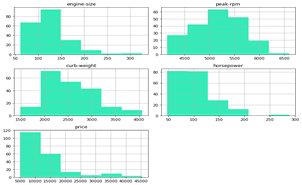

Findings

-   Most of the car has a Curb Weight is in range 1900 to 3100

-   The Engine Size is inrange 60 to 190

-   Most vehicle has horsepower 50 to 125

-   Most Vehicle are in price range 5000 to 18000

-   peak rpm is mostly distributed between 4600 to 5700

**Findings**

-   More than 70 % of the vehicle has Ohc type of Engine

-   57% of the cars has 4 doors

-   Gas is preferred by 85 % of the vehicles

-   Most produced vehicle are of body style sedan around 48% followed by
    > hatchback 32%

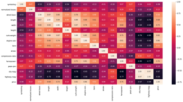

**Findings**

-   curb-size, engine-size, horsepower are positively corelated

-   city-mpg,highway-mpg are negatively corelated

**Price Analysis**

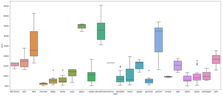

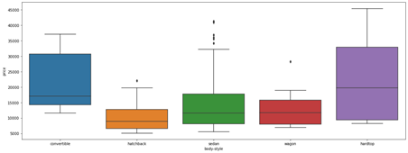

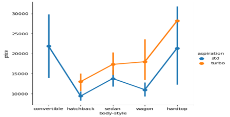

**Findings**

-   Mercedez-Benz ,BMW, Jaguar, Porshe produces expensive cars more than
    > 25000

-   cheverolet,dodge, honda,mitbushi, nissan,plymouth subaru,toyota
    > produces budget models with lower prices

-   most of the cars company produces car in range below 25000

-   Hardtop model are expensive in prices followed by convertible and
    > sedan body style

-   Turbo models have higher prices than for the standard model

-   Convertible has only standard edition with expensive cars

-   hatchback and sedan turbo models are available below 20000

-   rwd wheel drive vehicle have expensive prices

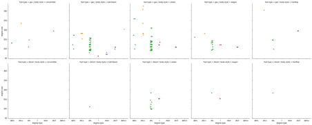
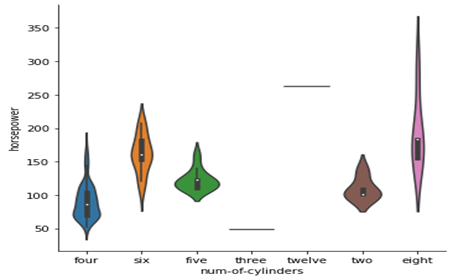

**Findings**

-   ohc is the most used Engine Type both for diesel and gas

-   Diesel vehicle have Engine type \"ohc\" and \"I\" and engine size
    > ranges between 100 to 190

-   Engine type ohcv has the bigger Engine size ranging from 155 to 300

-   Body-style Hatchback uses max variety of Engine Type followed by
    > sedan

-   Body-style Convertible is not available with Diesel Engine type

-   Vehicle with above 200 horsepower has Eight Twelve Six cyclinders

> 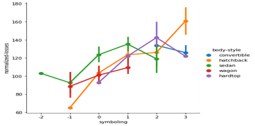

**Losses Findings**

Note :- here +3 means risky vehicle and -2 means safe vehicle

-   Increased in risk rating linearly increases in normalised losses in
    > vehicle

-   covertible car and hardtop car has mostly losses with risk rating
    > above 0

-   hatchback cars has highest losses at risk rating 3

-   sedan and Wagon car has losses even in less risk (safe)rating

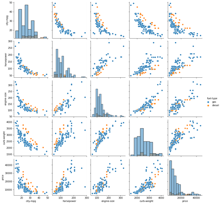

**Findings**

-   Vehicle Mileage decrease as increase in Horsepower , engine-size,
    > Curb Weights

-   As horsepower increase the engine size increases

-   Curbweight increases with the increase in Engine Size

**Price Analysis**

-   engine size and curb-weight is positively co-related with price

-   city-mpg is negatively correlated with price as increase horsepower
    > reduces the mileage

**THIS REPORT WAS WRITTEN BY : Thabo Moeketsi**

